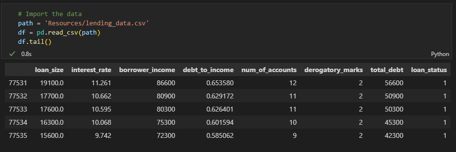
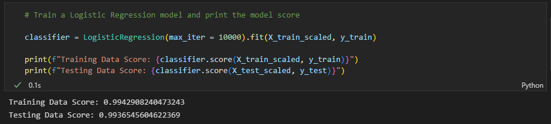
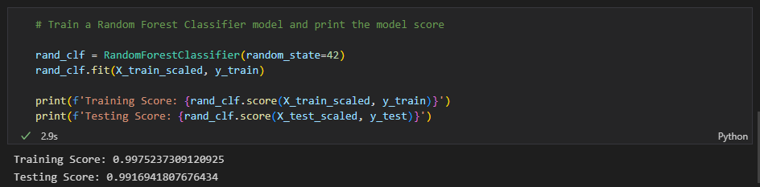
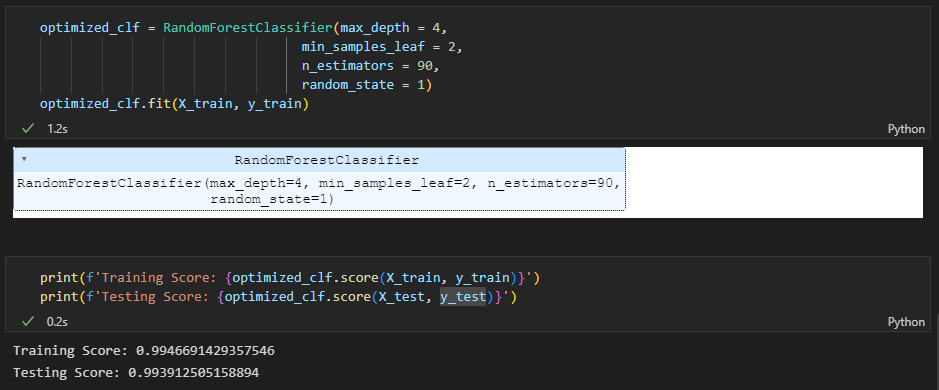

# Supervised Machine Learning Challenge: Credit Risk Evaluator
In this project, I apply two models, Logistic Regression and Random Forest Classifier, to analyze loan records and credit risk.

## Prediction
I predict the random forests classifier will be more accurate than logistic regression in prediction of risk level resulting in a loan status of 0 or 1, as the factors used in determining loan status my not have equal bearing on risk. The random forests classifier can factor in various interactions between features. Logistic Regression, on the other hand, do not characterize complex relationships between multiple features very well, and runs on the assumption that independent and dependent variables are linearly dependent.

## Tools and Libraries
* Python
* Numpy
* Pathlib
* Sklearn
   * train_test_split
   * GridSearchCV
   * StandardScaler
   * LogisticRegression
   * RandomForestClassifier

## Data
[lending_data.csv](Resources/lending_data.csv)

## Steps
1. Import data from CSV to a DataFrame

2. Split data into a training and test sets
3. Scale data
4. Run logistic regression model

5. Run a random forest classifier model without hyperparameters

6. Conduct grid search for best parameters
7. Run a random forest classifier model with hyperparameters

## Results
The testing score of the Random Forest Classifer model was slightly higher than the Logistic Regression model, but not by a significant amount. In this case, depending on the random state selected, the better scoring model may switch. Running a GridSearchCV to optimize selected hyperparameters did increase the testing score by a small degree.

The prediction that the Random Forest Classifer would have the advantage was therefore incorrect. The ambiguous results may be due to the fact that the fit for both the models was very close to 1, indicating that the dataset might be constructed and not similar to real-world data.

